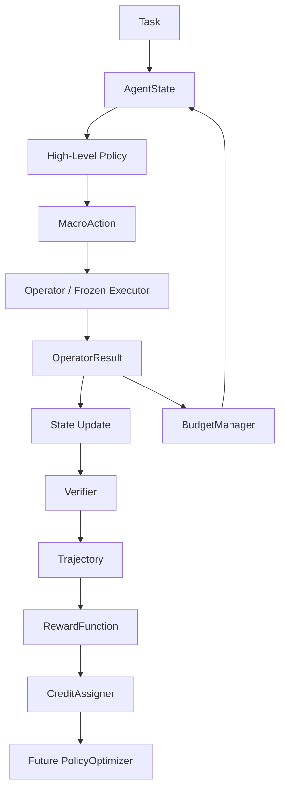

# RS-AF

**A CPU-first research scaffold for hierarchical policy optimization and
long-horizon credit assignment in LLM agents.**

RS-AF extends the AFlow codebase with a typed, testable runtime for dynamic
agent workflows. A high-level controller chooses macro actions while a frozen
or mocked low-level executor performs them. The current stage focuses on
interfaces, reproducible rollouts, structured trajectories, verifier signals,
budget enforcement, and credit-assignment baselines—not full PPO/GRPO training.

> Current status: deterministic CPU mock environment, 31 unit/integration
> tests, no GPU, model download, external API, or private environment variable
> required.

## Research Scope

RS-AF studies **Hierarchical Policy Optimization for Long-Horizon LLM Agents**.

The system has two levels:

1. **High-Level Workflow Controller** — selects the next macro action from
   operators such as Plan, Generate, Review, Revise, Test, Tool, Ensemble, and
   Stop.
2. **Low-Level Executor** — executes the selected operator. It is frozen or
   deterministic in the current stage and can later be connected to an LLM.

The central algorithmic question is how to assign terminal and intermediate
feedback to high-level decisions across long, branching trajectories.

## Architecture



The high-level policy never owns the environment or executor. Runner-side
defensive copies prevent policies and operators from mutating live state.

## Implemented Components

| Area | Current implementation |
|---|---|
| State/action contracts | `AgentState`, `MacroAction`, `OperatorResult`, `VerifierResult` |
| Policies | `RandomPolicy`, `RuleBasedPolicy`, `ScriptedPolicy`, `ReplayPolicy` |
| Execution | `OperatorRegistry`, `HierarchicalRolloutRunner`, Stop handling |
| Budgets | High-level steps, operator calls, simulated tokens, accumulated cost |
| Feedback | `ProgressVerifier`, deterministic verifier hooks, sparse/shaped rewards |
| Trajectories | Stable JSONL schema, dataclass/enum serialization, round trip |
| Credit | Terminal broadcast, discounted return, progress delta |
| Compatibility | Adapters for legacy AFlow async Operators and Workflows |
| Future training | Explicit `PolicyOptimizer` interface; no fake trainer implementation |

`CounterfactualCreditAssigner` is intentionally an unimplemented interface. A
correct implementation requires alternative rollouts, cached execution, or a
learned value model.

## Quick Start

Run the deterministic mock experiment from the repository root:

```bash
python -m agentic_rl.examples.run_mock_rollout \
  --policy rule \
  --credit-method progress_delta \
  --seed 42 \
  --output runs/mock.jsonl
```

Expected summary:

```json
{"final_reward": 1.0, "policy": "rule_based", "steps": 5, "termination_reason": "success"}
```

The successful rule-based sequence is:

```text
Plan → Generate → Review → Revise → Test
```

The default mock path uses only the Python standard library. This stricter
check also works:

```bash
python -S -m agentic_rl.examples.run_mock_rollout \
  --policy rule \
  --credit-method discounted_return \
  --seed 42 \
  --output /tmp/rs-af-stdlib.jsonl
```

Use the example YAML configuration when PyYAML is installed:

```bash
python -m agentic_rl.examples.run_mock_rollout \
  --config config/hierarchical_mock.example.yaml
```

## Tests

The research scaffold uses standard-library `unittest`:

```bash
python -m unittest discover -s tests -v
python -m compileall -q agentic_rl tests
```

Coverage includes serialization, registry errors, budget exhaustion, policy
legality and reproducibility, Stop, max-step termination, executor/verifier
exceptions, state-mutation isolation, JSONL round trips, all three credit
baselines, legacy AFlow adapters, and end-to-end CPU smoke tests.

In the deterministic 20-seed comparison used by the tests, RuleBasedPolicy
finishes 20/20 tasks while RandomPolicy finishes 0/20.

## Trajectory Data

Each normal JSONL row records one high-level decision:

- schema, run, task, policy, and step identifiers;
- summarized previous state and available actions;
- selected macro action and operator observation;
- verifier score, progress, pass/fail result, and feedback;
- step reward, final reward, assigned credit, and cost;
- termination reason and structured metadata.

The serializer filters common hidden-reasoning fields. Raw chain-of-thought is
not required or persisted. A rollout that terminates before its first decision
uses a `trajectory_summary` record instead of inventing a fake action.

An example trajectory is available at [`runs/mock.jsonl`](runs/mock.jsonl).

## Project Layout

```text
agentic_rl/
  core.py          # state/action/result contracts
  policies.py      # high-level policy baselines
  operators.py     # operator registry
  budget.py        # unified budget accounting
  rollout.py       # dynamic hierarchical rollout runner
  trajectory.py    # transition schema and JSONL persistence
  verifiers.py     # verifier interfaces and CPU baselines
  rewards.py       # reward interfaces
  credit.py        # credit-assignment baselines
  adapters.py      # legacy AFlow compatibility
  mock.py          # deterministic mock environment
  optimization.py  # future policy optimizer contract
  examples/        # runnable CPU examples
tests/             # unit and smoke tests
docs/              # detailed architecture guide
scripts/           # original AFlow implementation
benchmarks/        # original AFlow evaluation code
workspace/         # original generated workflow baselines
```

See [`docs/hierarchical_policy_optimization.md`](docs/hierarchical_policy_optimization.md)
for detailed data flow, extension instructions, and research limitations.

## Extending RS-AF

### Add an operator

Implement:

```python
execute(state: AgentState, action: MacroAction) -> OperatorResult
```

Then register it with `OperatorRegistry`. Return public state changes through
`OperatorResult.metadata["state_updates"]`; do not mutate the input state.

### Add a policy

Implement:

```python
select_action(state: AgentState, available_actions: list[str]) -> MacroAction
```

The same interface can support a deterministic controller, an LLM controller,
or a future trainable controller.

### Add a credit assigner

Implement:

```python
assign(trajectory: Trajectory) -> list[float]
```

The result must contain exactly one credit value per high-level decision.

## Relationship to AFlow

RS-AF preserves the original AFlow implementation as a baseline. AFlow searches
over code-represented workflows using historical score-based resampling, LLM
workflow mutation, evaluation, and experience records. RS-AF adds a separate
within-task controller that dynamically selects operators and records
step-level trajectories.

Legacy AFlow experiments still require their original dependencies, datasets,
LLM configuration, and external API access. These are not required for the
RS-AF CPU mock path.

## Roadmap

1. Connect one frozen real LLM executor through the adapter layer.
2. Collect paired trajectories under fixed tasks, budgets, seeds, and executor
   versions.
3. Compare terminal broadcast, discounted return, and progress-delta credit.
4. Add cached alternative-action rollouts for counterfactual experiments.
5. Introduce a small trainable high-level controller, optionally with LoRA.
6. Implement and evaluate PPO/GRPO only after credit semantics are validated.
7. Add policy versioning, trajectory datasets, and distributed rollout later.

## Current Limitations

- The default runner is synchronous.
- Mock token and cost values are deterministic placeholders.
- The rule-based policy is a baseline, not a learned policy.
- There is no value model, counterfactual estimator, GPU trainer, vLLM runtime,
  or distributed rollout system yet.
- A JSONL file currently represents one rollout.

## Acknowledgement and Citation

RS-AF is built on the open-source
[AFlow](https://github.com/FoundationAgents/AFlow) codebase. If you use the
inherited AFlow implementation or build on its workflow-search ideas, cite:

```bibtex
@inproceedings{
  zhang2025aflow,
  title={{AF}low: Automating Agentic Workflow Generation},
  author={Jiayi Zhang and Jinyu Xiang and Zhaoyang Yu and Fengwei Teng and Xiong-Hui Chen and Jiaqi Chen and Mingchen Zhuge and Xin Cheng and Sirui Hong and Jinlin Wang and Bingnan Zheng and Bang Liu and Yuyu Luo and Chenglin Wu},
  booktitle={The Thirteenth International Conference on Learning Representations},
  year={2025},
  url={https://openreview.net/forum?id=z5uVAKwmjf}
}
```

The inherited AFlow license remains in [`LICENSE`](LICENSE).
