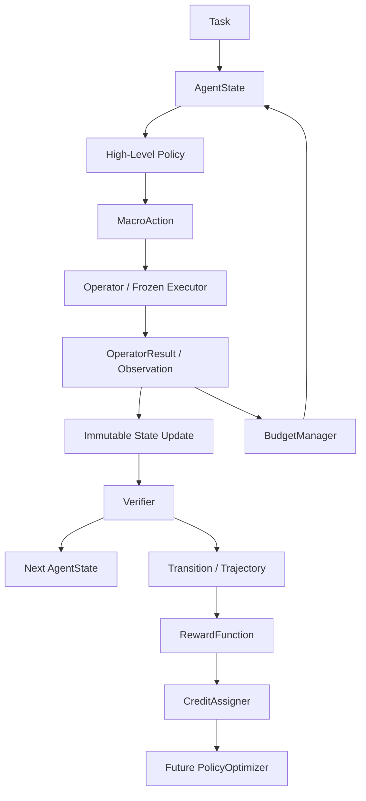

# Hierarchical Policy Optimization for Long-Horizon LLM Agents

本文档描述 AFlow 仓库中的增量式研究框架 `agentic_rl`。当前阶段的目标是以 CPU、确定性 mock executor 建立动态 rollout、轨迹和 credit assignment 的可测试边界；不实现真实 LLM 训练、PPO/GRPO 或分布式执行。

## 1. 原始 AFlow 架构

原始入口为 `run.py`，主要调用链如下：

```text
run.py
  -> Optimizer.optimize()
  -> Optimizer._optimize_graph()
  -> 选择历史 workflow 轮次
  -> 优化 LLM 生成 modification / graph.py / prompt.py
  -> GraphUtils 动态 import 新 Workflow
  -> Evaluator.graph_evaluate()
  -> BaseBenchmark.run_evaluation()
  -> 保存 results.json / CSV / experience.json
```

- `scripts/operator_an.py` 定义 Operator 输出的 Pydantic schema。README 中提到的 MetaGPT `ActionNode` 已不在当前仓库。
- `scripts/operators.py` 定义 Generate、Review、Revise、Test、Ensemble 等异步 LLM Operator。
- `scripts/workflow.py` 是很薄的异步 callable 基类；实际 workflow 是 `workspace/<dataset>/workflows/round_N/graph.py` 中按轮次生成的 Python 类。
- `scripts/optimizer.py` 使用历史分数选择父 workflow、让优化 LLM 修改代码并重新评估。
- `scripts/evaluator.py` 和 `benchmarks/` 将生成的 workflow 放到数据集上评分。

现有搜索更准确的名称是 **MCTS-like workflow search**：它有基于历史高分轮次的概率重采样、LLM mutation 和父子经验记录，但没有显式 tree node、UCB、visit count 或 reward backpropagation，因此不是标准 MCTS。

## 2. 新架构与原 AFlow 的关系

本轮没有移动或改写 `scripts/`、`benchmarks/`、`workspace/` 和原入口。新增的 `agentic_rl/` 是独立的 additive layer：

- CPU 核心不 import OpenAI SDK、Pandas 或旧日志模块；
- 旧 AFlow optimizer 继续作为静态 workflow/code-search baseline；
- 新 runner 在一次任务内动态选择 macro action；
- `AFlowOperatorAdapter` 可将旧异步 Operator 包成冻结的低层 executor；
- 未来可将旧 benchmark 的终局 score 适配为 terminal verifier/reward，但不能直接假设它提供 step-level credit。

两个优化层次不要混淆：

| 层次 | 原始 AFlow | 新 `agentic_rl` |
|---|---|---|
| 决策粒度 | 一轮生成完整 workflow 代码 | 每个 task step 选择一个 macro action |
| 搜索/学习对象 | workflow graph/code | High-Level Policy |
| 执行 | LLM Operator workflow | frozen/mock executor |
| 反馈 | dataset 终局平均分 | step verifier + terminal reward |
| 当前优化 | LLM mutation + 重采样 | 仅接口与 credit baseline，未训练 |

## 3. 数据流和模块边界



主要文件：

- `core.py`：`AgentState`、`MacroAction`、`OperatorResult`、`VerifierResult` 及 Protocol。
- `operators.py`：类型安全的 `OperatorRegistry`。
- `policies.py`：`RandomPolicy`、`RuleBasedPolicy`、`ScriptedPolicy`、`ReplayPolicy`。
- `budget.py`：step、operator call、token 和 cost 四类预算。
- `rollout.py`：动态、budget-aware 的 `HierarchicalRolloutRunner`。
- `trajectory.py`：`Transition`、`Trajectory` 和 JSONL round trip。
- `verifiers.py`、`rewards.py`、`credit.py`：相互分离的反馈、奖励和 credit 接口。
- `optimization.py`：未来 trainer 的 `PolicyOptimizer` Protocol 和显式未实现占位。
- `mock.py`：确定性 CPU state machine、mock operators、verifier 和 experiment builder。
- `adapters.py`：旧 AFlow Operator/Workflow 的可选兼容层。

高层 policy 只接收 state 和合法 action 名称，不能直接修改 state，也不依赖任何 LLM SDK。Operator 返回显式 `OperatorResult`；默认 updater 以 copy-on-write 方式构造 next state。

## 4. State、Action 与终止

`AgentState` 包含 task/task_id、step、结构化 memory、last observation、verifier feedback、剩余 budget、done 和 metadata。mock 环境只在 metadata 中维护公开状态机变量，如 phase、progress 和 candidate quality。

`MacroAction` 包含 operator name、结构化 arguments 和 metadata。当前通用 action 名称可覆盖 Plan、Generate、Review、Revise、Test、Tool、Ensemble 和 Stop；registry 只暴露某个环境实际支持的子集。

Runner 支持以下终止原因：

- `success`：verifier 通过；
- `stop`：policy 显式选择 Stop；
- `max_steps`、`max_operator_calls`、`token_budget`、`cost_budget`；
- `state_done`；
- policy、operator 或 verifier exception；
- 非法 policy action。

Operator exception 会变成结构化失败 transition，不会让整个数据收集进程无记录地崩溃。Stop 是高层决策，记录 transition 和 step，但不计 operator call。

## 5. Verifier、Reward 与 Credit 的区别

三者语义严格分开：

1. **Verifier** 观察 previous state、action 和 next state，提取 score、progress、passed 和 feedback；它不负责训练更新。
2. **RewardFunction** 将 verifier/environment 信号变成 step reward 和 final reward。mock 默认使用稀疏成功奖励，可选 progress shaping。
3. **CreditAssigner** 在 rollout 完成后，把可观测奖励分配到历史高层决策。

已实现的 credit baseline：

- `TerminalRewardBroadcast`：所有有效高层决策共享 final reward。
- `DiscountedReturn(gamma)`：从每个时刻计算 step reward 加独立 terminal reward 的 return-to-go。
- `ProgressDeltaCredit`：第 t 步 credit 为相邻 verifier progress 差。
- `CounterfactualCreditAssigner`：仅定义配置和接口，调用会明确抛出 `NotImplementedError`。

真正的 counterfactual credit 至少需要以下一种能力：同一历史状态的 alternative action rollout、可复用的冻结 executor cache，或经过验证的 value model。当前代码不会用无语义的启发式方法冒充反事实算法。

## 6. Budget-aware rollout

`BudgetManager` 同时维护：

- 最大高层 step；
- 最大 operator 调用数；
- token budget（当前由 mock operator 产生确定性模拟 token）；
- 累积 cost budget。

每一步之后，policy 可从 `state.budget` 读取剩余量及累计用量。真实 executor adapter 后续可以从 provider usage 中填充 `OperatorResult.token_cost` 和 `cost`，无需修改 runner。

## 7. 可复现轨迹

正常 rollout 的 JSONL 每行是一条 `Transition`，schema version 为 `1.0`，包含：

- run/task/policy/step identity；
- state summary；
- action 和当时的 available actions；
- operator observation/result；
- verifier result；
- step/final reward 和 assigned credit；
- cost、termination reason 和 metadata。

序列化支持 dataclass、enum 和常用容器；字段顺序稳定，可 round trip。state summary 只记录 memory size，不默认落盘完整 memory。常见 `chain_of_thought`、`raw_reasoning` 等 metadata key 会被过滤。轨迹不要求、也不应保存隐藏思维链；需要调试时应保存结构化 reasoning summary。

当 rollout 因零预算、initial done 或 policy error 在第一次决策前结束时，JSONL 会保存一条 `record_type=trajectory_summary` 的 envelope；它不是伪造的 policy decision，因此不会参与 credit 计算，但仍可恢复 run identity、final reward 和 termination reason。

## 8. CPU mock 实验

mock 是一个简化代码修复状态机，支持 Plan、Generate、Review、Revise、Test、Tool、Fail 和 Stop。合法顺序会逐步增加 progress；过早 Test/Stop、错误顺序和预算不足会产生不同结果。

从仓库根目录运行：

```bash
python -m agentic_rl.examples.run_mock_rollout \
  --policy rule \
  --credit-method progress_delta \
  --seed 42 \
  --output runs/mock.jsonl
```

比较随机 policy：

```bash
python -m agentic_rl.examples.run_mock_rollout \
  --policy random \
  --credit-method terminal \
  --seed 42 \
  --output runs/mock-random.jsonl
```

使用示例配置：

```bash
python -m agentic_rl.examples.run_mock_rollout \
  --config config/hierarchical_mock.example.yaml
```

固定 seed 42 时，RuleBasedPolicy 走完五步并成功，RandomPolicy 首步 Stop、reward 为 0。单测还比较了 20 个固定 seed，RuleBasedPolicy 的成功率显著更高。

## 9. 如何扩展

### 新增 Operator

实现同步 `execute(state, action) -> OperatorResult`，然后注册：

```python
registry.register("MyOperator", MyOperator())
```

Operator 不应修改输入 state；把公开的环境更新放入 `OperatorResult.metadata["state_updates"]`，把可持久化摘要放入 observation/memory_updates。

复用旧 AFlow Operator 时，用 `AFlowOperatorAdapter` 提供显式 `argument_builder`，因为旧 Operator 的参数名并不统一。adapter 支持普通或 async callable，但同步 runner 不能嵌套在已经运行的 asyncio loop 中。

### 新增 Policy

实现：

```python
select_action(state: AgentState, available_actions: list[str]) -> MacroAction
```

LLM controller 可在此接口后生成结构化 action；trainable controller 可额外暴露 log-prob/value，但不要把这些训练细节塞进 environment 或 Operator。

### 新增 Verifier/Reward/Credit

- Verifier 实现 transition-level `evaluate`；
- Reward 实现 `step_reward` 和 `final_reward`；
- CreditAssigner 实现 `assign(trajectory) -> list[float]`，输出长度必须等于高层决策数。

## 10. 后续接入训练系统

推荐按以下边界逐步扩展：

1. **真实 frozen executor**：通过 adapter 接入 LLM API 或本地 vLLM，先保证同一 action schema 和 usage accounting。
2. **数据收集**：为 controller 保存 action log-prob、sampling metadata 和 policy version，但继续禁止隐式 CoT 成为训练数据必需字段。
3. **value/credit 实验**：先做 terminal broadcast、discounted return、progress delta 的离线对照，再加入 cached alternative rollout。
4. **trainable controller**：实现 `PolicyOptimizer`；LoRA 只作用于高层 controller，低层 executor 冻结。
5. **PPO/GRPO**：在已有 rollout/trajectory 边界外实现 trainer，使用 trajectory 中的 assigned credit，不让 GPU 框架反向侵入 environment。
6. **分布式 rollout**：最后加入 task queue、policy versioning、idempotent run_id 和 trajectory store。

## 11. 当前限制

- 只有同步 runner；旧 async AFlow Operator 通过 adapter 在无活动 event loop 时运行。
- mock 的 token/cost 是确定性模拟值，不是真实 tokenizer/provider 账单。
- RuleBasedPolicy 是演示 baseline，不是可训练策略。
- 没有 value model、alternative rollout cache 或 counterfactual estimator。
- 没有 GPU、vLLM、LoRA、PPO、GRPO 或分布式组件。
- JSONL loader 将单个文件视为一个 rollout；多 rollout 数据集应使用独立文件或后续 dataset reader。
- 原始 AFlow 完整实验仍需要模型配置、数据集和外部 API；本轮没有改变这些要求。
- 当前 checkout 的 `run_baseline.py` 引用了不存在的生成轮次；这是原仓库既有问题。

## 12. 最小 credit assignment 研究计划

第一阶段可在 frozen executor 下执行：

1. 固定 task set、operator registry、budget 和 controller policy version；
2. 对同一批 task/seed 收集完整 trajectory；
3. 分别计算 terminal broadcast、discounted return 和 progress delta；
4. 比较 action-level credit 方差、与最终成功的相关性、对 horizon/budget 的敏感性；
5. 对关键 state 缓存 executor 结果，再对单步 alternative action 做有限 counterfactual rollout；
6. 用 paired seeds/bootstrap 报告 credit estimator 差异；
7. 只有在离线指标和语义检查通过后，才接一个小型 LoRA controller 做 policy update。
